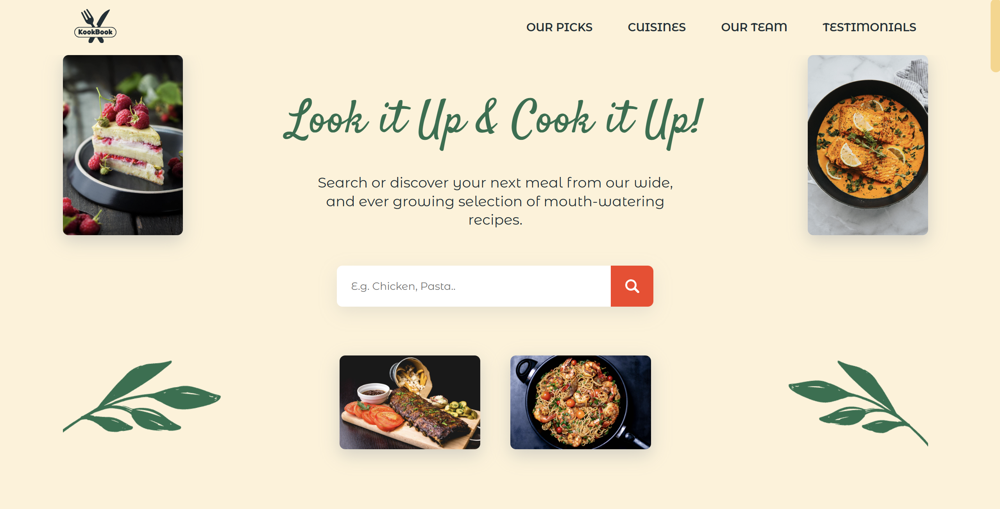

# Koobook 🍳 Recipe Finder

[](https://kookbook.vercel.app)

🔗 **Live Demo:** https://kookbook-recipe-finder.vercel.app/  
📂 **Source Code:** https://github.com/AdnanMGHaider/kookbook-recipe-finder

---

## Screenshot



---

## Table of Contents

- [About](#about)
- [Key Features](#key-features)
- [Tech Stack](#tech-stack)
- [Getting Started](#getting-started)
  - [Prerequisites](#prerequisites)
  - [Installation](#installation)
  - [Running Locally](#running-locally)
  - [Deploying to Vercel](#deploying-to-vercel)
- [Project Structure](#project-structure)
- [Future Enhancements](#future-enhancements)
- [Contributing](#contributing)
- [Author](#author)

---

## About

**Koobook Recipe Finder** is a single-page React application that lets users discover 600 k+ recipes by cuisine, keyword, or dietary preference using the Spoonacular API.  
It showcases client-side routing, animated transitions, lazy-loaded chunks, and a polished, mobile-first UI—perfect for demonstrating modern React skills to hiring managers.

---

## Key Features

|                                                                  |                                                            |
| ---------------------------------------------------------------- | ---------------------------------------------------------- |
| 🔍 **Instant search** – debounced queries with loading skeletons | 🍝 **Cuisine pages** – Italian, Thai, American, etc.       |
| 📋 **Recipe detail** – ingredients, instructions, nutrition      | 🎬 **Smooth animations** – Framer Motion route transitions |
| 🖼 **Responsive carousel** – Swiper touch & mouse-drag            | 🔐 **Secure API key** – stored in `.env`, ignored in Git   |
| 🏎 **Code-splitting** – React lazy + Suspense                     |

---

## Tech Stack

| Layer          | Tools / Libraries                      |
| -------------- | -------------------------------------- |
| **UI & State** | React 17, React Router v6, Context API |
| **Styling**    | CSS Modules                            |
| **Animation**  | Framer Motion                          |
| **Carousel**   | Swiper.js 8                            |
| **Data API**   | Spoonacular REST                       |
| **Build**      | Create-React-App (react-scripts 5)     |
| **Hosting**    | Vercel (static)                        |

---

## Getting Started

### Prerequisites

- **Node 18+** and **npm 9+** (or Yarn/PNPM)
- Spoonacular API key (free tier works)

### Installation

```bash
git clone https://github.com/AdnanMGHaider/kookbook-recipe-finder.git
cd kookbook-recipe-finder
npm install
```

### Environment Variables

Create a .env file in the project root:

```bash
REACT_APP_API_KEY=<your-spoonacular-key>
```

### Running Locally

```bash
npm start        # http://localhost:3000
npm run build    # production bundle in /build
```

### Deploying to Vercel

1. Push the repo to GitHub.
2. Vercel → New Project → import the repo.
3. Build settings:

   - **Build Command:** `npm run build`
   - **Output Dir:** `build`

4. Add env var `REACT_APP_API_KEY`.
5. Click Deploy. Done!

---

## Project Structure

```text
kookbook-recipe-finder/
├── public/
├── src/
│   ├── Assets/
│   ├── Components/
│   ├── Pages/
│   ├── App.js
│   └── index.js
├── docs/
│   └── screenshots/
│       └── kookbook-screenshot.png
├── .env.example
└── README.md
```

## Future Enhancements

- “Save to favourites” with localStorage / backend
- PWA offline caching
- Jest + RTL test suite
- Dark-mode toggle

## Contributing

1. Fork the repo
2. Create a feature branch:
   ```bash
   git checkout -b feature/<name>
   ```
3. Commit your work
   ```bash
   git commit -m "Add <feature>"
   ```
4. Push your branch

   ```bash
   git push origin feature/<name>
   ```

5. Open a Pull Request

---

## Author

> **Built & maintained by [Adnan Haider](https://www.linkedin.com/in/adnan-haider-dev/)**
